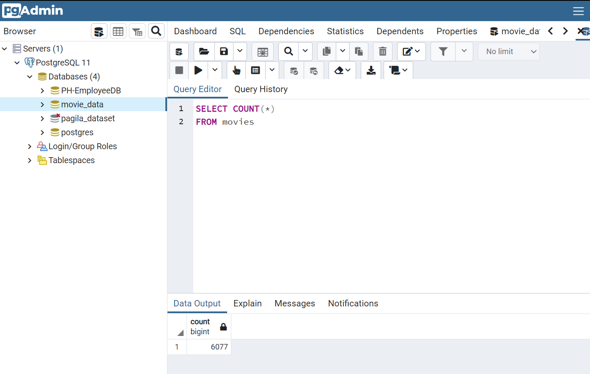
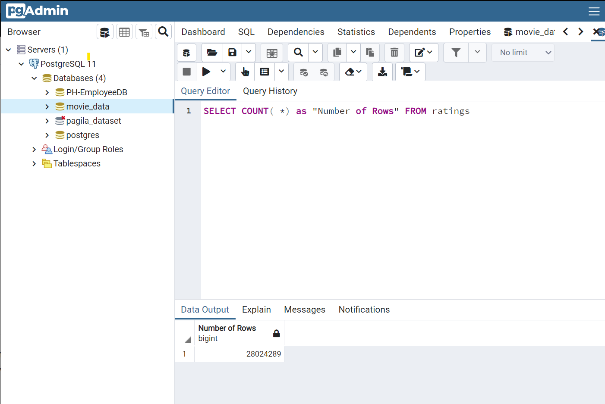

# Movies-ETL
Perform the ETL process by adding the data to a PostgreSQL database 

## Overview of the Project
create an automated pipeline that takes in new data, performs the appropriate transformations, and loads the data into existing tables.

Deliverable 1: Write an ETL Function to Read Three Data Files
Deliverable 2: Extract and Transform the Wikipedia Data
Deliverable 3: Extract and Transform the Kaggle data
Deliverable 4: Create the Movie Database

## Resources
- Data Source: credit.csv, keywords.csv, links.csv, links_small.csv, movies_metadata.csv, ratings.csv, ratings_small.csv
- Output Data Base: movie_data 
- Software: Jupytor Notebook, Postgres, pdAdmin 4

## Results
From the Deliverable 4: We confirm that the movies table has 6,052 rows and the ratings table has 26,024,289 rows.
Below query codes are used to retrieve the data from movie_data Database from pgAdmin:
`
SELECT COUNT(*)
FROM movies;`

*** Movie table Row Count Screen Shot***
      
      
`
SELECT COUNT( *) as "Number of Rows"
FROM ratings;`

*** Rating table Row Count Screen Shot***

      
